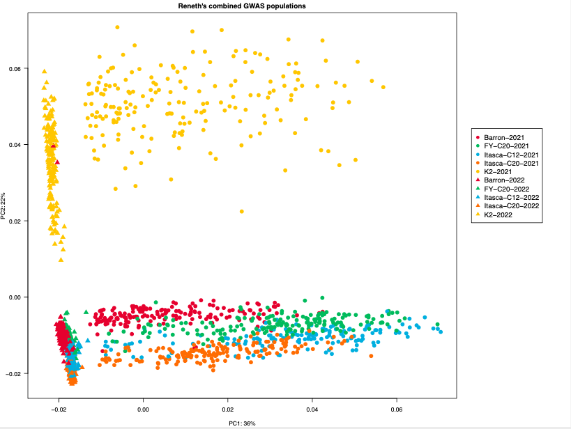

# README for _Make Combined GWAS PCA plot_
Steps taken to make a combined PCA plot for Reneth's GWAS populations from 2021 and 2022


There are a couple of different ways that I thought about how to make a combined PCA plot for Reneth's GWAS data from 2021 and 2022.
1. Merge separate VCF files and import into plink as a single VCF file
2. Merge separate VCF files into plink independently and then combine them within plink
3. Re-do the SNP calling step with all of the samples from both years, then import into plink like normal

I chose option 3, mostly because I tried the other approaches first and they failed for various reasons. Option 3 isn't ideal because of the extra time and computational resources that it takes; however, it seems like the approach with the greatest likelihood of success.

The first time that I tried option 3, it also failed. I think the reason for this was because the working directory (`/scratch.global/haasx092/combined_gbs_data`) only contained a text file with paths to the data. However, while the code could understand where the data were, it could not successfully execute the scripts because the _data_ were not in the working directory. I fixed this by creating symbolic links (symlinks) to the data (bam files as well as the index files-- .bam.csi)

The first step was to create year-specific text files that contained the full paths to the data:
```bash
# make separate text files for the 2021 and 2022 datasets
# this is necessary because otherwise the samples with identical sample names from both years will create a conflict at the symlink stage (I previously used a single combined text file with paths to data from both years)
ls /scratch.global/haasx092/reneth_gwas/*/*bam > reneth_gwas_2021_bams.txt
ls /scratch.global/haasx092/reneth_gbs_july_2022/*/*bam > reneth_gwas_2022_bams.txt
```

Next, we can make the actual symlinks by iterating through the text files we've just created in a for loop:
```bash
# make symbolic links (for 2021 bams)
for i in $(cat reneth_gwas_2021_bams.txt); do
STEM=$(echo $i | cut -f 5 -d "/")
ln -s $i ${STEM}_2021.bam
done

# make symbolic links (for 2022 bams)
for i in $(cat reneth_gwas_2022_bams.txt); do
STEM=$(echo $i | cut -f 5 -d "/")
ln -s $i ${STEM}_2022.bam
done
```

Now, we need to make the text files for the year-specific bam index files:
```bash
# Now do the same for the index files (*.bam.csi)
ls /scratch.global/haasx092/reneth_gwas/*/*csi > reneth_gwas_2021_csi_files.txt
ls /scratch.global/haasx092/reneth_gbs_july_2022/*/*csi > reneth_gwas_2022_csi_files.txt
```

And the last/final step before moving on to the actual SNP re-calling step is to make the symlinks for the bam index files:
```bash
# make symbolic links (for 2021 csi files)
for i in $(cat reneth_gwas_2021_csi_files.txt); do
STEM=$(echo $i | cut -f 5 -d "/")
ln -s $i ${STEM}_2021.bam.csi
done

# make symbolic links (for 2022 csi files)
for i in $(cat reneth_gwas_2022_csi_files.txt); do
STEM=$(echo $i | cut -f 5 -d "/")
ln -s $i ${STEM}_2022.bam.csi
done
```

**Note:** The reason that I added the "\_2021" and "\_2022" at the end of the stem of each file name was because there are sample numbers that occur in both years and this approach means that they can co-exist in the VCF files. This is because each bam file represents a single sample and these bam file names become the sample names in the VCF file. You can use the original keys from 2021 and 2022 to figure out the identity of any of these samples. You would only need to remove the "\_2021" or "\_2022" prior to using pattern matching (for example, using `VLOOKUP` in Excel). Just make sure you're using the right sample key!

There is one more necessary step before the SNP calling can begin. I needed to make a text file listing all of the bam files to the script could iterate through it in the [scythe_mpileup.sh](snp_calling/scythe_mpileup.sh) script. I acheived this with the following line of code:
```bash
# make a file with bam files (symlinked) for both years
ls *bam > combined_years_bams.txt
```

I then did the SNP calling with the script [scythe_mpileup.sh](snp_calling/scythe_mpileup.sh). The SNP calling and filtering steps are almost identical to the steps that I took when I analyzed the analyze the years separately. The only difference is that I increased the threshold for read quality from `-q 20` to `-q 40`. This was mostly to reduce the total number of SNPs because we have so many that we don't actually need to keep all of them _just for the purpose of making a combined PCA plot_.

The SNP calling step took **2 days, 13 hours, 30 minutes, and 45 seconds**, so know that this will take a while.

Once the SNP calling step was done, I could move on to the SNP filtering step. I accomplished this with the script [filter_with_vcftools.sh](filter_vcfs/filter_with_vcftools.sh] which uses the text file [vcf_file_list.txt](helper_files/vcf_file_list.txt) to filter the relevant VCF files. I used the following parameters: maximum 10% missing data, bi-allelic sites only, minor allele frequency = 3%, and a minimum read depth of 8 reads per site.

The filtering step took **1 hour, 42 minutes, and 38 seconds** and the VCF concatenation step took **25 seconds**.

The final PCA (PC1 vs. PC2) looks like this:



## Some details about the other approaches that I tried:

I thought I could simply merge the two existing, separate VCF files into a much larger VCF file. I previously used the [BCFtools `concat`](https://samtools.github.io/bcftools/bcftools.html#concat) function to make a single VCF file (`merged_vcf_files.vcf`). The `concat` function is useful because after the SNP calling step, there are individual VCF files for each chromosome. They all have the same samples, so the `concat` function just enables us to make a single VCF file that has all of the chromosomes. **Note:** I did the concatenation step _after_ I did the filtering. I have always (for example, in the genetic diversity and other GBS-related projects) done this before moving the SNP data into plink. (However, the scripts that I used to generate the SNP matrix used the separate, filtered VCF files.)

For some silly reason, the [BCFtools `merge`](https://samtools.github.io/bcftools/bcftools.html#merge) function should allow me to _merge multiple VCF/BCF files from non-overlapping sample sets to create one multi-sample file_. Those words are taken directly from the documentation. However, it _does not work_. I get an error message that the VCF files need to be _bg-zipped_. I guess that's fair since I'm trying to merge two non-zipped files. The filtering step using VCFtools does not bg-zip the files like the [scythe_mpileup.sh](snp_calling/scythe_mpileup.sh) does (on line 38). HOWEVER, when I try to use the `bgzip` function from SAMtools, the command isn't even recognized. Despite the fact that it works just fine when used in the SNP calling script 🤷‍♂️.

I also thought this could be done within [plink](https://zzz.bwh.harvard.edu/plink/index.shtml) itself. The documentation includes a section about [merging multiple filesets](https://zzz.bwh.harvard.edu/plink/dataman.shtml#mergelist). I attempted to follow the documentation's instructions, but it didn't work. The code from my script is shown below. I attempted to import each independent VCF file into plink and then merge them

```bash
module load plink

plink --vcf reneth_gwas/220809_snp_calling_results/merged_vcf_files_2021.vcf --mind 0.99 --write-snplist --make-bed --double-id --allow-extra-chr --recode --out reneth_gwas_2021
plink --vcf reneth_gbs_july_2022/220804_snp_calling_results/merged_vcf_files_2022.vcf --mind 0.99 --write-snplist --make-bed --double-id --allow-extra-chr --recode --out reneth_gwas_2022

plink --file reneth_gwas_2021 --bmerge reneth_gwas_2022 --flip --double-id --allow-extra-chr --recode --out merge
```

The error message is:<br>
```bash
Error: Missing --flip parameter.
For more information, try "plink --help <flag name>" or "plink --help | more".
```

However this is pretty unhelpful as I don't know how strandedness matters to us. Our data are unphased, so strandedness shouldn't matter.... And even if it did, I'm only trying to merge two datasets into one.


Of course, I could have made a mistake or there could be a more complicated way of achieving the goal of combining two datasets (that might involve moving data back to VCF files). However, we already have VCF files so we are right back at square one.
